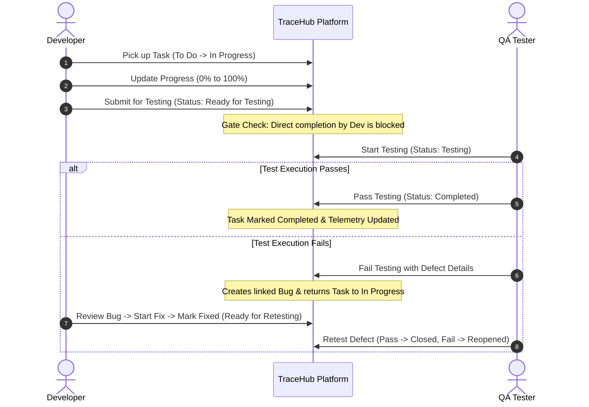

# TraceHub SDLC Workflow & Architecture Specification

This document specifies the end-to-end software delivery lifecycle workflow and quality gate validation criteria implemented in TraceHub.

## 1. 7-Phase SDLC Lifecycle

TraceHub enforces a strict sequential progression through seven standardized phases:

```
1. Requirement Analysis
   ├── Capture functional & business requirements
   ├── Assign priority matrices (Critical, High, Medium, Low)
   └── Quality Gate: >= 80% requirements formally approved
2. Planning
   ├── Scope definition, milestone roadmap & budget estimation
   └── Quality Gate: Project members allocated & sprint backlog seeded
3. Design
   ├── System architecture, UI/UX mockups, API schema contracts
   └── Quality Gate: Architecture review & tech stack sign-off
4. Development
   ├── Sprint task execution via interactive Kanban board
   ├── Developer code implementation and unit test coverage
   └── Quality Gate: All tasks submitted with progress >= 100%
5. Testing
   ├── Step-by-step QA test case execution
   ├── Defect logging, developer patch handoff, and QA retesting
   └── Quality Gate: 100% test pass rate, 0 open Critical/High defects
6. Deployment
   ├── Release deployment to Staging and Production environments
   └── Quality Gate: Deployment checklist verified & smoke test passed
7. Maintenance
   └── Post-release SLA ticket tracking and enhancement requests
```

## 2. Developer & QA Quality Gate Contract



## 3. Role Matrix Summary

| Capability | Project Manager | Developer | QA Tester |
|---|---|---|---|
| Create Projects & Phases | Yes | No | No |
| Create & Prioritize Requirements | Yes | View Only | View Only |
| Assign Sprint Tasks | Yes | No | No |
| Update Task Progress & Code Notes | Yes | Yes (Assigned) | No |
| Submit Task for QA Testing | No | Yes | No |
| Execute Test Cases | View Only | View Only | Yes |
| Fail Task & Report Defect | Yes | No | Yes |
| Mark Defect Fixed with Notes | No | Yes | No |
| Close Defect via Retest | No | No | Yes |
| Advance SDLC Phases | Yes (Requires Gate Criteria) | No | No |
